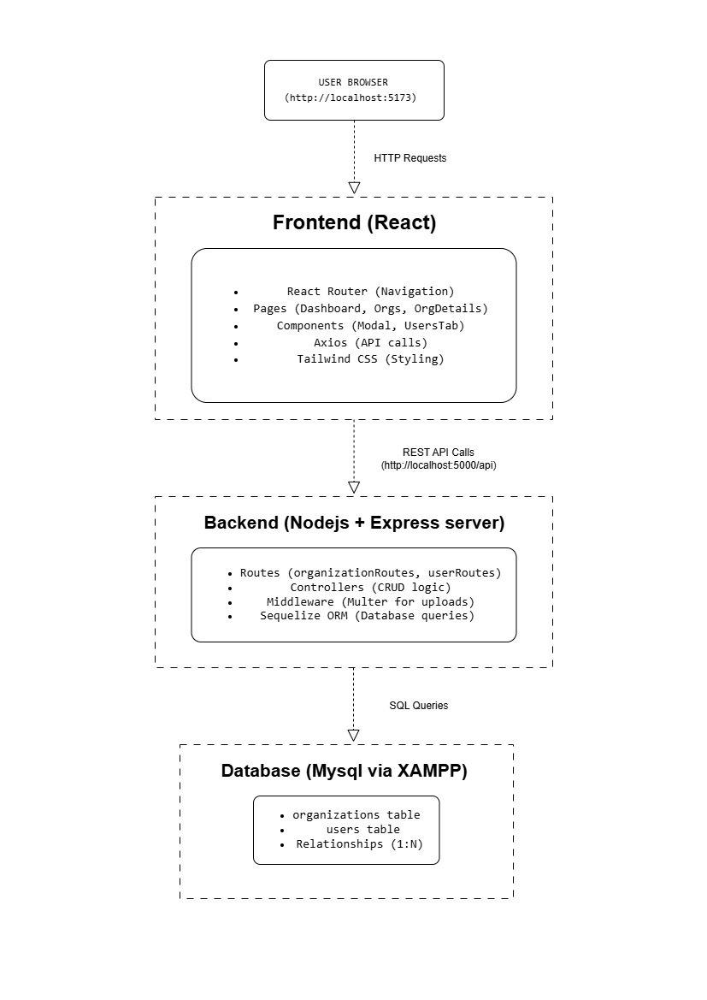

# INTERVIEW-BUDDY-TASK

*Empower Your Interview Journey with Confidence and Clarity*


## Built with the tools and technologies:


## 🚀 Features

- **Dashboard** with real-time statistics (total organizations, users, active/inactive counts)
- **Organizations Management**: Create, read, update, delete organizations with logo upload
- **Users Management**: Add, edit, delete users with role assignment and serial numbers
- **Search & Filter**: Find organizations by name/email and filter by status
- **Responsive UI**: Built with Tailwind CSS and SweetAlert2 notifications

## 🛠️ Tech Stack
### Frontend
- **React 18** - UI library
- **Vite** - Build tool
- **React Router** - Navigation
- **Tailwind CSS** - Styling
- **Axios** - API calls
- **SweetAlert2** - Notifications

### Backend
- **Node.js** - Runtime
- **Express.js** - Web framework
- **Sequelize** - ORM
- **MySQL** - Database
- **Multer** - File uploads
- **CORS** - Cross-origin support

## 📁 Project Structure
<pre>
project-root/
├── Backend/
│   ├── src/
│   │   ├── config/
│   │   │   └── db.js
│   │   ├── models/
│   │   │   └── Organizations.js
│   │   │   └── user.js
│   │   ├── controllers/
│   │   │   └── organizationController.js
│   │   │   └── userController.js
│   │   ├── routes/
│   │   │   └── OrganizationRoutes.js
│   │   │   └── userRoutes.js
│   │   └── middleware/
│   │   │   └── upload.js
│   │   └── app.js
│   │   └── server.js
│   ├── uploads/
│   ├── .env
│   ├── README.md
│   ├── pacakage-lock.json
│   └── package.json
│
├── Frontend/
│   ├── src/
│   │   ├── api/
│   │   │   └── axiosInstance.js
│   │   ├── assets/
│   │   ├── components/
│   │   │   └── AddOrganizationModal.jsx
│   │   │   └── UsersTab.jsx
│   │   ├── layouts/
│   │   │   └── DashboardLayout.jsx
│   │   ├── pages/
│   │   │   └── DashboardPage.jsx
│   │   │   └── OrganizationDetails.jsx
│   │   │   └── OrganizationDetails.jsx
│   │   └── App.jsx
│   │   └── App.css
│   │   └── main.jsx
│   │   └── index.css
│   └── .gitignore
│   └── README.md
│   └── eslint.config.js
│   └── index.html
│   └── package.json
│   └── package-lock.json
│   └── postcss.config.js
│   └── tailwind.config.js
│   └── vite.config.js
│   └── public/
│
├── .gitignore
└── README.md
</pre>

## 🔌 API Endpoints

### Organizations
- `GET /api/organizations` - Get all organizations
- `GET /api/organizations/:id` - Get single organization
- `POST /api/organizations` - Create organization
- `PUT /api/organizations/:id` - Update organization
- `DELETE /api/organizations/:id` - Delete organization
- `POST /api/organizations/:id/logo` - Upload logo

### Users
- `GET /api/users/organization/:id` - Get users by organization
- `GET /api/users/count` - Get total user count
- `GET /api/users/count/organization` - Get user count per organization
- `POST /api/users` - Create user
- `PUT /api/users/:id` - Update user
- `DELETE /api/users/:id` - Delete user


## 🔧 Installation & Setup

### Prerequisites
- Node.js (v16 or higher) - [Download here](https://nodejs.org/en)
- XAMPP - [Download here](https://www.apachefriends.org/download.html)
- npm (comes with Node.js)

### Step 1️⃣: Start XAMPP MySQL
1. Open XAMPP Control Panel.  
2. Click **Start** for Apache *(optional, for phpMyAdmin)*.  
3. Click **Start** for MySQL *(required!)*.  
4. MySQL should now be running on port **xxxx**.

### Step 2️⃣: Create Database
1. Open browser: http://localhost/phpmyadmin
2. Click New (left sidebar)
3. Database name: `interviewbuddy_db`
4. Collation: `utf8mb4_general_ci`
5. Click Create

### Step 3️⃣: Clone & Setup Backend
```
# Clone repository
git clone https://github.com/yourusername/b2b-management-system.git
cd b2b-management-system

# Navigate to backend
cd Backend

# Install dependencies
npm install
```

### Step 4️⃣: Configure Environment Variables
Create .env file in Backend/ folder:
```
DB_HOST=localhost
DB_USER=root
DB_PASSWORD=<db_password>
DB_NAME=<db_name>
DB_DIALECT=mysql
PORT=5000
```
**Note:** XAMPP MySQL default password is empty (no password). If you set a password in XAMPP, update DB_PASSWORD accordingly.

### Step 5️⃣: Start Backend Server in the Backend folder
`npm run dev` <br>

You should see something like this 👇: 


Backend is now running on http://localhost:5000

### Step 6️⃣: Setup Frontend
Open a new terminal (keep backend running):
```
# Navigate to frontend
cd Frontend

# Install dependencies
npm install

# Start development server
npm run dev
```
You should see something like this 👇: 


Frontend is now running on http://localhost:5173

## Keep both Frontend & Backend running while testing!

## 📊 Entity Relationship (ER) Diagram
The ER diagram models a one-to-many relationship between Organizations and Users, where each organization can have multiple users, and deleting an organization cascades to its users.<br>


## 🏛️System Architecture (High-Level) 

This shows your full stack structure:<br>


## 🎬 Working Demo

https://github.com/user-attachments/assets/72bed702-540f-49d6-b47f-d283beb7e473

## 🔒 Security & Best Practices
- Used Sequelize ORM to prevent SQL Injection
- Environment variables for sensitive credentials
- File upload validation for logos (type & size)
- CORS configuration to secure API access


## 🤝 Contributing
I built this application end-to-end — backend APIs, database schema, frontend UI, and deployment setup.<br>
Focused on writing clean, modular, and well-documented code with proper error handling, ensuring scalability and maintainability.<br>

## 🚀 Future Enhancements
- Add JWT Authentication for secure access
- Implement Docker Compose for one-click setup
- Add unit tests using Jest
- Host demo on Render / Vercel for easy preview

## 🏁 Conclusion
This project fulfills all functional and technical requirements of the InterviewBuddy Full-Stack Assignment — showcasing skills in frontend development, backend architecture, database design, and API integration.<br>


